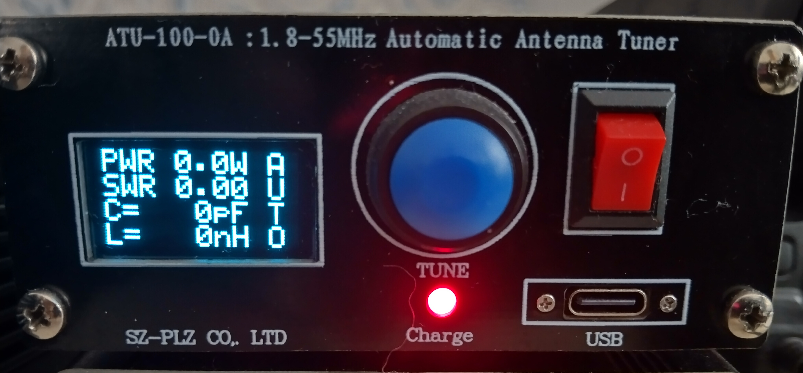

# Antenna tuner - ATU-100 EXT-YAF-2 Yet Another Firmware, debugged and improved by SP6PW


## The original projects by N7DDC and DG4SN but debugged and improved by me (SP6PW)
https://github.com/Dfinitski/N7DDC-ATU-100-mini-and-extended-boards and https://github.com/DG4SN/ATU-100-EXT-YAF .
Many thanks for them :)

## Imported Notes
This firmware only works with the ATU-100_EXT (7x7) hardware, the PIC16F1938 MCU and the OLED Display 128x64px.
In some ATUs can be necessary to rotate display in defines.h by #define DISPLAY_ROTATE FALSE or #define DISPLAY_ROTATE TRUE.
Before you start please make a backup of the original firmware and be sure that you can restore it.
```diff
- You act at your own risk!
```
## Features
+ Function menu on display – one button operation
+ 10 memory slots for tune-settings one of them as a startup setting
+ Calibration function for the integrated power meter
+ Configurable Auto-Tuning function
+ Sleep function for battery saving in every menu, relays state backup and recovery
+ Bypass function 

## Button functions
**Button short pressed:** _____ *Start Tuning or select next item* 

**Button long pressed:** ______ *Enter Menu or change value* 

## Menu-tree
+ Bypass ______*Bypass the current tuning settings*
+ Load Tune __ *Load tune setting from memory slots*
+ Save Tune __ *Save the current tuning settings in 10 memory slots*
+ Reset ______ *Reset all settings to defaults*
+ Setup
     - Tuning _____ *Set tune parameters (Auto tune on/off), SWR start and stop tresholds*
     * Sleep ______ *Set sleep mode and time*
     * Calibrate __ *Calibrate the power measurement at two points*
     * Test _______ *Test function for each relay*
+ About ______ *Who developed it*

## Calibration
The firmware includes a two point calibration function for the integrated power meter.
It is recommend to calibrate on the lowest (max 10W) and highest (max 100W) used power level.
For calibration you need a transmitter with adjustable TX power and a dummy load.
. Now is precalibrated.

## Programmer
For programming a PICkit3 or XGecu T48 programmer is used.
When the ATU-100 is switched off, connect it in the shown way.
After that switch on the ATU-100

You do not need flash eeprom because you can reinit every setting to default value by menu "Reset all"

## Programming Tool
If you only like to flash the firmware you can use the Microchip Integrated Programming Environment
**MPLAB X IDE**.
The needed hex-file you find as the latest release


## Development IDE
For development the Microchip **MPLAB X IDE v6.25** was used.
The IDE is available for free on the Microchip web side.


